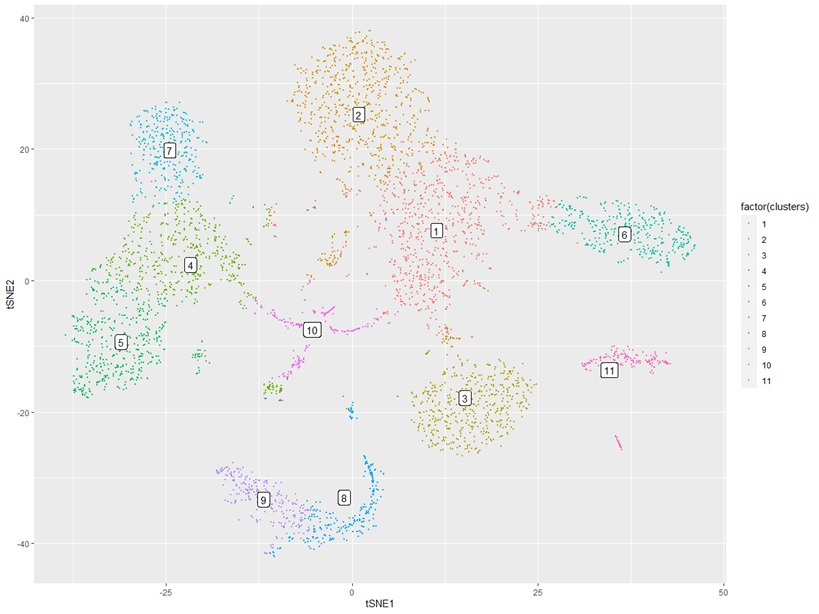
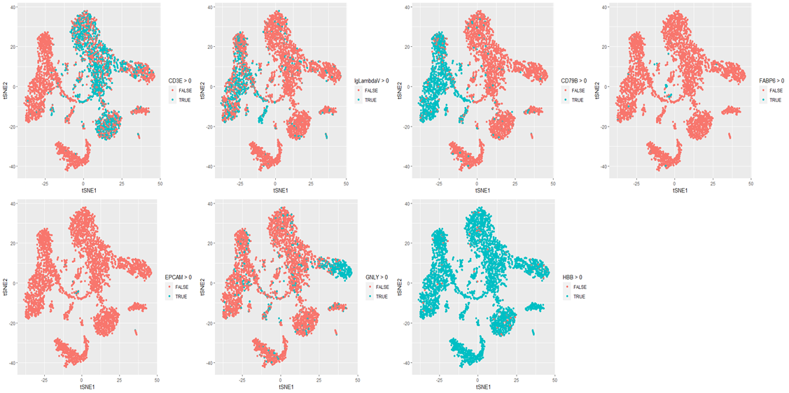

# Porcine Immune Single Cell Atlas

## Ambient RNA correction
Ambient RNA in scRNA-seq samples were cleaned using R package SoupX (v1.4.5; https://github.com/constantAmateur/SoupX) in Rstudio (v1.1.447; R v3.6.2).
Required packages: dplyr, scran, knitr, ggplot2, Rtsne, cowplot, Seurat, tidyr, DropletUtils, SoupX.
```
pacman::p_load(dplyr, scran, knitr, ggplot2, Rtsne, cowplot, Seurat, limma, tidyr, DropletUtils, SoupX, DoubletFinder)
setwd ("Raw count matrix location")

```

### A
Load raw read count matrix into R environment using load10X function from Seurat.
```
sc <- load10X('A/')
dd <- sc$metaData
mids <- aggregate(cbind(tSNE1,tSNE2) ~ clusters,data=dd,FUN=mean)
ggplot(dd,aes(tSNE1,tSNE2)) + geom_point(aes(colour=factor(clusters)),size=0.2) + geom_label(data=mids,aes(label=clusters))
```



